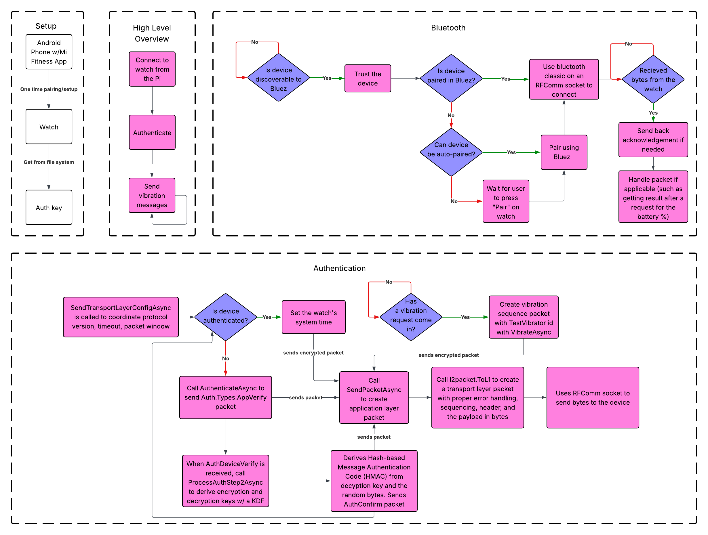

# Mi Band 10 Controller for Notifications on the Tatum1 Robot
A standalone application for controlling Xiaomi Mi Band devices via Bluetooth SPP on a Raspberry Pi.
This program connects to a Mi Band 10, authenticates, and can send vibration patterns or fetch the device's battery/sensor data.
It's in C#, but was ported from the Rust [AstroBox repo](https://github.com/AstralSightStudios/AstroBox-NG).
They documented the Xiaomi protocol and provide a library to connect/authenticate/communicate with the watch.

The code was ported from the following AstroBox modules developed by AstralSight Studios under the GNU Affero General Public License at the time of writing:
- The core (authentication and connection) - [core](https://github.com/AstralSightStudios/AstroBox-NG-Module-Core)
- The Google ProtoBuf protocol files - [pb](https://github.com/AstralSightStudios/AstroBox-NG-Module-Pb)
- Bluetooth - [btclassic-spp](https://github.com/AstralSightStudios/AstroBox-NG-Plugin-BtClassicSpp)

## The C# code depends on a few NuGet packages:
- [Google ProtoBuf](https://protobuf.dev/)
- [Microsoft's Logging](https://www.nuget.org/packages/microsoft.extensions.logging/)
- [D-Bus](https://github.com/tmds/Tmds.DBus) (and its source generator) for bluetooth connection through BlueZ on Linux
- [YamlDotNet](https://github.com/aaubry/YamlDotNet) to parse the config file

## Getting the authentication token

1. Install the official [Mi Fitness](https://play.google.com/store/apps/details?id=com.xiaomi.wearable&hl=en_US) app on an Android phone (I used version 3.47.0)
2. Sign in and connect to the Mi Band
3. Go to the phone's Bluetooth settings
4. Tap on the Mi Band and press "Unpair" in the bottom right
5. Connect the phone to any computer via USB
6. In file explorer, navigate to:
   
   [Phone Name]\Phone\Android\data\com.xiaomi.wearable\files\log\
   
   Replace [Phone Name] with the phone's name like Galaxy S9+
7. Copy XiaomiFit.main.log from the phone to your computer
8. Open the file in a text editor and search for `"token":`
9. Copy the token value (it should look something like: `13b6840ba233108fd714cbae5f7a3346`)
10. The watch is might still be connected to the Android phone. In that case, disconnect the watch from the Android phone's bluetooth settings. Then, go to the watch's Settings -> System -> "Connect new phone". On this new screen (there should be a QR code, don't scan it), you must press "Pair" if it pops up while trying to connect to the Pi later.

(based on the instructions from [GadgetBridge](https://gadgetbridge.org/basics/pairing/huami-xiaomi-server/#mi-fitness-mi-health-xiaomi-wear))

## Configuring the code

In the config.yml file in the main folder, there are a few settings that must be configured for each watch before running the code.

```yaml
device:
  name: "Xiaomi Smart Band 10 8DCA" # the name of the watch may be different from this, but check what it appears as in the Bluetooth connections menu on the phone/computer
  mac_address: "04:34:C3:A4:8D:CA"  # paste in the watch's MAC address, found in the watch's Settings, in the About section
  auth_key: "13b6840ba233108fd714cbae5f7a3346"  # paste in the token from the folder of the official Mi Fitness app (read the section above this one about the authentication token)
  ```

Adding custom vibration patterns can be done by changing the patterns field in the config file. Here's an example one with two quick pulses.
The durations are in milliseconds and the strengths are from 0 to 100.

```yaml
patterns:
  example_pattern:
  - on: true
    duration: 100
    strength: 100
  - on: false
    duration: 100
  - on: true
    duration: 100
    strength: 100
```

You can also configure the logging in the config to change the filtering to only show warnings, debug, or whatever for each class.

## Building and using the app
Run this to build it for the pi:
```bash
dotnet publish -c Release -r linux-arm64
```
The executable will be at `\bin\Release\net8.0\linux-arm64\publish\XiaomiAstroBoxCSharp`.
Make sure the config.yml file is in the same directory as the executable when you run it on the Pi, or specify its file location as the first command line argument.
To test the app, make sure you have the bluetooth group on Linux:
```bash
sudo usermod -aG bluetooth your_user
```
then restart the Pi.
In the bluetoothctl, scan for the watch (make sure you see the QR code screen on the watch. If you don't, go into Settings -> System -> Connect new phone).
To scan for the watch, first run the `bluetoothctl` command and enter in these into the [bluetooth] command line:
```bash
power on
scan on
```
Then, wait until you see the Xiaomi watch. It can take a minute! It should print the MAC address and the full name of the watch (which should match the ones in your config!).
Run the `exit` command to exit out of the bluetooth command line.
Now everything should be set up to run the code!
```bash
chmod +x ./XiaomiAstroBoxCSharp
./XiaomiAstroBoxCSharp
# or...
./XiaomiAstroBoxCSharp path/to/config.yml
```
Long term, you need to setup the Linux service to keep it going on restart and on shutdown (such as if the watch disconnects or the user walks too far away from the Pi):
```bash
sudo nano /etc/systemd/system/mi_band_controller.service
```
Then paste in the `mi_band_controller.service` from this repo and run these commands:
```bash
sudo systemctl enable mi_band_controller
sudo systemctl start mi_band_controller
```
But right now the only way to trigger vibrations is by command line and typing in commands manually.
You can enter in the following commands:
- "battery" to fetch the battery %
- "wearing" to fetch if the user is wearing the watch
- "clock" to set the system time
- Any of the names of the patterns listed in config.yml


## Bluetooth Communication
- Uses the RPI's Bluetooth Classic through BlueZ
  - It knows the MAC address from the config
	- It pairs with the device
	- Trusts it so it doesn't have to pair again
- For networking, it implements both the Transport layer (L1) and Application Layer (L2) parts of the traditional networking layers
- Transport layer
	- Xiaomi has a header of 0xA5A5 for syncing
	- Has sequence numbers to track packets (first packet is seq #1, second is #2, etc.)
	- Acknowledges (ACK) packets by sending a message
	- Error detection
- Application Layer
	- Uses AES-128-CTR encryption (look at the L2Cipher class in the CryptographyHelper.cs file)
	- Has "WearPacket" data
- The data flow:
	1. Google's Protobuf data structures
	2. Application (L2) layer encryption
	3. Transport (L1) layer sequencing, framing, gaurenteeing of packets
	4. Bluetooth SPP raw bytes
- The authentication code flow:
    1. L1 handshake to communicate config like packet size, timeouts, etc.
	2. Sends encryption challenge of 16 random bytes, which Xiaomi expects for security 
	3. Sends auth key found earlier from the official Mi Fitness app
	4. Creates a cipher for the L2 layer so that it can send encypted WearPackets going forward
- Packets:
	- Uses Google's Protobuf to create packets and define their structure
	- Uses AstroBox's reverse engineered .proto files to know that packet structure


## Bluetooth flow diagram


## Future things to do
- Integrate it with the rest of trManager and the rest of the code
- Improve the vibration patterns and define ones for calling, messaging, etc.
    - You could cancel the vibration (such as if the user picks up the phone call) by sending a blank pattern
- Implement different vibration strengths per user since some users have a harder time feeling the vibrations than others
- Set the system time on the watch to the actual time with the correct time zone
- Improve reconnection and make it reconnect within the same process. Right now, it has to shut down before it can reconnect. The Linux service is meant to restart it after a delay. Users walking away with the watch and going out of bluetooth range will cause it to restart a lot, which would have to be considered in the final product.
- Update timezone to the user's actual location
- Using the battery fetching functionality to notify the user when the battery percent gets low

## What I've tested already
- Causes the watch to disconnect, but auto-pair when the program is restarted:
	- Walking away from the Pi
	- Rebooting the watch
	- Restarting the Pi
	- Pressing "connect new phone" will cause the device to disconnect: "Connection closed!"
- Sending different patterns
- Tried all of the different settings and none of them affect the vibrations it can receive
- Sending one pattern while another is still running (it just stops the old one and starts the new one)
- Sending a blank pattern
- Getting battery percent and setting the system time
- Always uses less than 2% of the CPU, usually 0% except when sending vibration commands
- Battery life of the watch is very good - from constant usage and a constant bluetooth connection over 4 days, it only used 12% of the battery (100% -> 88%). It's supposed to have 20 days of battery life
- Deleting the watch from the official Mi Fitness app has no impact on the Pi connecting, so long as the watch isn't connected to the phone's bluetooth
- Placing the Pi inside the robot's box. It doesn't seem to affect the bluetooth connectivity, but further testing is needed on the physical range of the connection
## Known issues
- When the device is reset, the auth key resets
- When the device is disconnected from bluetooth, the app crashes and must be restarted with a Linux service
- There's no feedback for when exactly the vibration actually ends
    - If you wanted to control this very precisely, you could send a very very long pattern, make sure it's acknowledged, wait a specific number of seconds, send a blank pattern, then make sure that's acknowledged
- When connecting from a brand new Pi, you must go into bluetoothctl and do `power on` `scan on` or else the discovery of the watch won't work
- If the bluetoothctl `power off` command is run, it has and error: "No route to host"
- The watch thinks its time zone is GMT
- The RequestIsWearingWatchAsync doesn't work. For some reason the watch doesn't return any response at all!
- It won't run on Windows because it uses Linux system calls

## Useful resources
- [Gadgetbridge](https://codeberg.org/Freeyourgadget/Gadgetbridge)
- [AstroBox](https://github.com/AstralSightStudios/AstroBox-NG)
- [AstroBox's .proto files (mainly the wear.proto and wear_system.proto)](https://github.com/AstralSightStudios/AstroBox-NG-Module-Pb/tree/main/protos/xiaomi)
- [Amazon link for the band we went with](https://www.amazon.com/Bcuckood-Compatible-Adjustable-Breathable-Replacement/dp/B0CP218DWN)
- [Lucidchart flowchart](https://lucid.app/lucidchart/5b3841c9-d670-4ee2-9d9e-7e517568980d/edit?viewport_loc=-180%2C-432%2C4318%2C1976%2C0_0&invitationId=inv_0180c94d-b45f-4fb8-b1d0-a16dcec13252)

## Using my code as an API
Assuming you have a logger factory and loggers set up for the bluetooth and device classes, create a bluetooth client:
```cs
using var bluetooth = new BluetoothSppClient(bluetoothLogger, loggerFactory);
```

Set up connect and disconnect listeners:
```cs
bluetooth.OnConnect(async () =>
{
    using var device = new XiaomiBand10(deviceLogger, bluetooth, authKey, loggerFactory);
	await device.AuthenticateAsync();
	// this can be used to gaurentee vibration messages were received
	device.OnAckReceived(sequence =>
    {
        Console.WriteLine($"ACK received for sequence {sequence}!");
    });
	// add logic to send vibrations, get battery %, etc.
}

bluetooth.OnDisconnect((string disconnectionReason) =>
{
    // add logic to reconnect or exit the program
});
```

Connect on bluetooth channel 5:
```cs
await bluetooth.ConnectAsync(deviceAddr, channel: 5);
```

Once connected, you can do any of the following:
```cs
// set watch system time
await device.SetWatchTimeAsync(TimeZoneInfo.ConvertTime(DateTime.UtcNow, myTimeZone), cts.Token);

// get battery percent from 0 to 100
uint batteryPercent = await device.RequestBatteryPercentAsync(cts.Token);

// send vibration patterns
await device.VibrateAsync(pattern, cts.Token);
// where pattern is a list of this structure:
/*
public class VibrationSegment
{
    public bool On { get; set; }
    public int Duration { get; set; }
    public int Strength { get; set; }
}
*/
```
